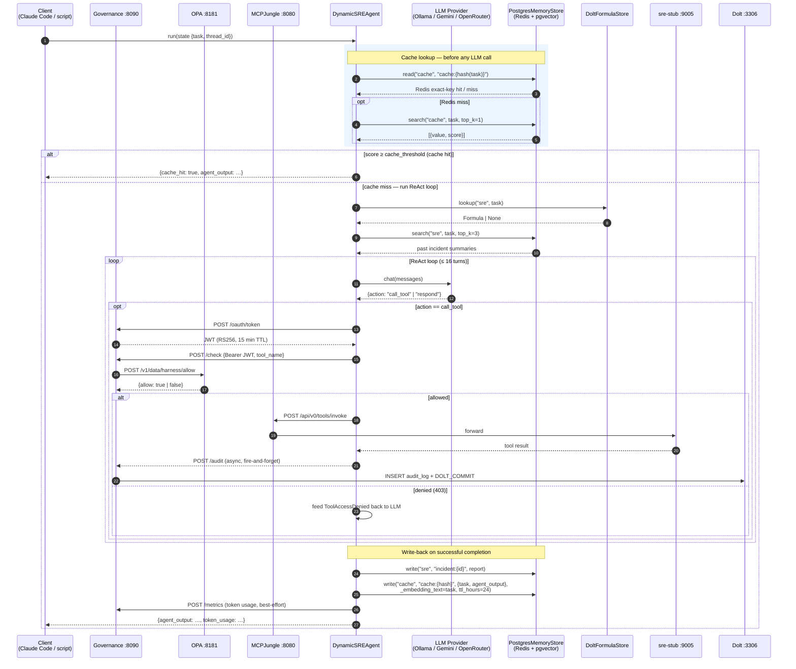
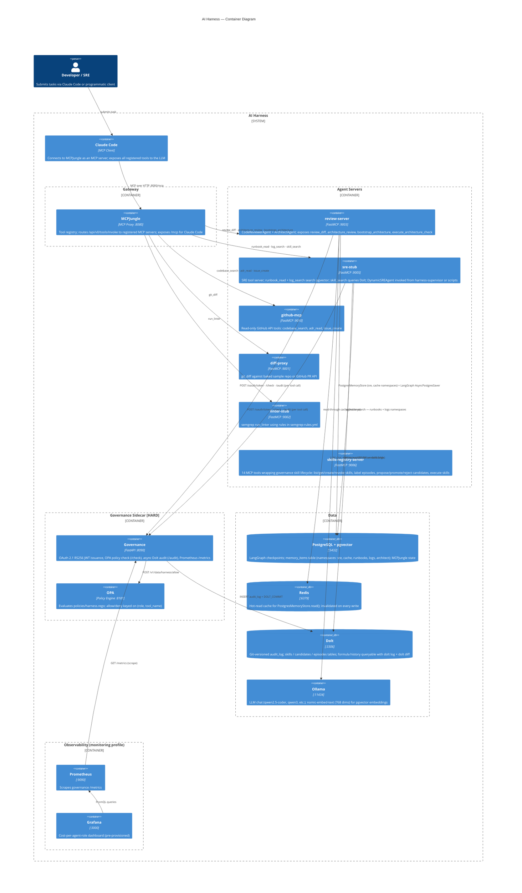

# AI Harness — Architecture

> This file is the authoritative architecture specification for the ai-harness project.
> It is consumed by both human developers and AI coding agents (Claude Code, Codex, etc.).
>
> Rules marked **[HARD]** are inviolable. If your solution requires violating a [HARD] rule,
> stop and surface the conflict rather than proceeding. Rules marked **[SOFT]** are strong
> preferences that require explicit justification to override.

---

## Overview

A governed, self-learning agent harness. Current capability: a code-review agent that takes
a git diff and returns structured security and quality findings with a pass/fail verdict.
Every tool call is authenticated, OPA-policy-checked, and committed to a tamper-evident Dolt
audit log before it reaches a tool server.

The harness also provides a three-layer memory architecture (Phase 2): a LangGraph checkpointer
for fault-tolerant graph execution, a vector memory store for cross-session agent knowledge,
and a Dolt formula store for versioned workflow templates.

Claude Code (or any MCP client) can call `review_diff` directly via MCPJungle. The agent's
internal tool calls route through the governance service, so the full review is auditable
end-to-end.

---

## Architectural Invariants

These are the non-negotiable constraints that define this system. Every other design decision
flows from them.

**[HARD]** The governance service MUST authorize every tool call before it reaches the gateway.
No agent code may invoke an MCPJungle (`:8080`) or ContextForge (`:4444`) tool without
first receiving a 200 OK from governance's `/check` endpoint. Governance handles auth,
policy, and audit as a sidecar (not a forwarding proxy — see ADR 0023).

**[HARD]** Every tool call — allowed or denied — MUST produce an audit row in Dolt and trigger
a `DOLT_COMMIT`. The audit log must be complete; partial audit is not acceptable.

**[HARD]** `harness-gateway` must not import from `harness-agents`, `harness-memory`, or `harness-tests`.

**[HARD]** `harness-agents` must not import from `harness-tests`.

**[HARD]** `harness-memory` must not import from `harness-agents` or `harness-tests`.

**[HARD]** `harness-supervisor` is the orchestration layer at the top of the runtime stack —
it may import `harness-agents`, `harness-memory`, and `harness-gateway`, but nothing other than
`harness-tests` may import from it.

**[HARD]** `harness-tests` is a test-only package. It must not be imported by any service
or runtime package (`governance`, `review_server`, `harness-gateway`, `harness-agents`, `harness-memory`, `harness-supervisor`).

**[HARD]** Any new tool added to a stub server or service MUST have a corresponding OPA policy
entry in `policies/harness.rego` before the change is considered complete. Tools without
policy entries default to deny — this is a feature, not a gap.

**[HARD]** The `audit_log` table is append-only. Application code must never issue DELETE or
UPDATE statements against it. The `harness` DB user enforces this at the database level,
but no application code should attempt it regardless.

**[SOFT]** New agent roles should be added as new OPA rule blocks, not by extending the tool
list of an existing role. Role boundaries should remain narrow and explicit.

**[SOFT]** New MCP servers should be implemented using FastMCP with streamable-HTTP transport,
consistent with all existing stub servers and service implementations.

---

## Package Dependency Direction

```
harness-supervisor       (orchestration — top of the runtime stack)
   │ may import ↓
harness-agents           harness-memory     (standalone — no runtime package deps)
   │ may import ↓
harness-gateway          (leaf — no runtime deps on other harness packages)

harness-tests            (test-only — may import any runtime package above)

Allowed imports (top → bottom only):
  harness-supervisor → harness-agents, harness-memory, harness-gateway
  harness-agents     → harness-gateway

✗  harness-gateway    → harness-agents      [HARD violation]
✗  harness-gateway    → harness-memory      [HARD violation]
✗  harness-gateway    → harness-supervisor  [HARD violation]
✗  harness-gateway    → harness-tests       [HARD violation]
✗  harness-agents     → harness-supervisor  [HARD violation]
✗  harness-agents     → harness-tests       [HARD violation]
✗  harness-memory     → harness-agents      [HARD violation]
✗  harness-memory     → harness-supervisor  [HARD violation]
✗  harness-memory     → harness-tests       [HARD violation]
✗  harness-supervisor → harness-tests       [HARD violation]
✗  any service        → harness-tests       [HARD violation]
```

`harness-supervisor` (LangGraph orchestration) is the only package permitted to
depend on all three of `harness-agents`, `harness-memory`, and `harness-gateway`.
Nothing may depend on `harness-supervisor` except `harness-tests`.

---

## Request Flow

The sequence below shows an SRE incident task end-to-end — the richest path through the system, covering the semantic cache, formula/memory retrieval, the ReAct tool-call loop with governance, and the write-back on success. The code-reviewer and architect paths are structurally identical from the governance sidecar onwards but omit the cache lookup.



Every tool call the agent makes produces:

1. An OPA policy decision (`allow` or `deny`)
2. A row in `audit_log` in Dolt (written async after the tool returns)
3. A Dolt git commit — queryable with `dolt log` and `dolt diff`

---

## Services

| Service          | Image                          | Port | Role                                                         |
|------------------|--------------------------------|------|--------------------------------------------------------------|
| `postgres`       | pgvector/pgvector:pg16         | 5432 | MCPJungle state, LangGraph checkpoints, vector memory store  |
| `redis`          | redis:7-alpine                 | 6379 | Hot-read cache for memory store                              |
| `opa`            | openpolicyagent/opa:latest     | 8181 | Policy engine — evaluates `policies/harness.rego`            |
| `mcpjungle`      | mcpjungle/mcpjungle:latest     | 8080 | MCP proxy / tool registry / MCP server for Claude Code       |
| `dolt`           | local build                    | 3306 | Git-versioned audit log + formula store                      |
| `governance`     | local build                    | 8090 | OAuth token issuance (`/oauth/token`), OPA policy check (`/check`), async Dolt audit (`/audit`) |
| `diff-proxy`     | local build                    | 9001 | Real `git diff` MCP server (baked sample repo)               |
| `linter-stub`    | local build                    | 9002 | Semgrep-based `run_linter` MCP server (`semgrep-rules.yml`)  |
| `github-mcp`     | local build                    | 9010 | GitHub API MCP server — `codebase_search`, `adr_read`, `issue_create` |
| `sre-stub`       | local build                    | 9005 | SRE-role MCP server: `runbook_read` + `log_search` do semantic pgvector search (`PG_DSN`); `skill_search` does Dolt formula lookup (`DOLT_HOST`); stub fallback without infra |
| `review-server`  | local build                    | 9003 | `review_diff`, `architecture_review`, `execute_architecture_check` MCP tools — runs full code-reviewer agent, architecture review, and architectural gate |
| `skills-registry-server` | local build             | 9006 | Skills registry MCP server — 14 tools wrapping governance skill lifecycle endpoints; uses `human-operator` OAuth credentials for all governance calls |
| `register-*`     | mcpjungle image                | —    | One-shot init containers that register MCP servers           |

---

## Container View (C4)



---

## Python Packages (Monorepo)

```
packages/
  harness-gateway/   — GatewayClient + ContextForgeGatewayClient + report_llm_usage()
  harness-agents/    — CodeReviewerAgent, DynamicSREAgent, ArchitectAgent, AgentState TypedDict, output schemas, build_llm_from_env() factory
  harness-memory/    — PostgresMemoryStore, DoltFormulaStore, ConsolidationWorker, runbook_retriever, log_retriever, skill_retriever
  harness-supervisor/ — LangGraph supervisor orchestration, graph nodes, approval tokens
  harness-tests/     — pytest integration + unit tests (508 total)

services/
  governance/        — OAuth 2.1 + OPA policy check + async Dolt audit + /metrics (rate limiting delegated to gateway)
  contextforge_setup/ — init script: registers MCP stubs with ContextForge, creates virtual server
  grafana/           — provisioned cost-per-role dashboard
  prometheus/        — scrape config for governance /metrics
  dolt/              — Dolt init: audit_log + formulas + formula_pours + seed data
  postgres/          — PostgreSQL init: enables pgvector extension
  github_mcp/        — FastMCP server wrapping GitHub API (codebase_search, adr_read, issue_create)
  review_server/     — FastMCP server wrapping CodeReviewerAgent + architecture_review + execute_architecture_check
  skills_registry/   — FastMCP server exposing 14 governance skill-lifecycle tools (list/get/create/revoke skills, label episodes, propose/promote/reject candidates, execute skills)

security/
  owasp-review.md    — OWASP Agentic AI Top 10 review

docs/runbooks/       — 4 operational runbooks (seeded into pgvector via `make seed-runbooks`)
docs/logs/           — JSONL log fixtures: cost-spike (8 entries) + db-latency (6 entries) (seeded via `make seed-logs`)
```

Dependencies: `harness-tests` → `harness-supervisor` → (`harness-agents`, `harness-memory`,
`harness-gateway`); `harness-agents` → `harness-gateway`; `harness-memory` is standalone (no
dependency on other harness packages). See
[Package Dependency Direction](#package-dependency-direction) above for the enforced direction.

---

## Governance Service

`services/governance/server.py` — policy + audit sidecar (not a forwarding proxy). Three endpoints:

1. **`POST /oauth/token`** — client credentials grant. Three clients: `architect`, `code-reviewer`, `sre`. Issues **RS256 JWTs** with `sub`, `role`, 15-min TTL, signed with a private RSA key loaded from `JWT_PRIVATE_KEY_FILE`. Verifier uses the derived public key — downstream services cannot mint tokens.
2. **`GET /jwks`** — returns the RSA public key as a JWK set for downstream verifiers.
3. **`POST /check`** — validates Bearer JWT, calls OPA `POST /v1/data/harness/allow`; returns `{"allowed": true, "role": ..., "agent_id": ..., "rule": ...}` on allow, 403 on deny. Also gates `shell_exec` behind `X-Human-Approval-Token`.
4. **`POST /audit`** — accepts an audit record from GatewayClient and writes to Dolt async (202 response, background task). Also writes an `episodes` row (independent background task). Emits Prometheus counters/histograms (`harness_tool_calls_total`, `harness_tool_call_latency_ms`). If the body contains `tool_name: "__llm__"` + `llm_tokens`, also increments `harness_llm_calls_total` and `harness_llm_tokens_total` (LLM usage reporting path). Auto-triggers expiry pass every `EXPIRY_PASS_INTERVAL` (default 1000) audit events.
5. **`POST /episodes/{id}/label`** — sets outcome + outcome_signal + outcome_labeled_at. Requires `episode:label` OPA scope (sre, code_reviewer). Enforces independence rule: labeler ≠ agent_principal.
6. **`POST /candidates`** / **`GET /candidates/{id}`** — propose a candidate from a qualified episode set (N_min=5, K=2 principals, M=2 recent). Requires `candidate:propose` scope.
7. **`POST /candidates/{id}/promote`** / **`POST /candidates/{id}/reject`** — human gate. Requires `skill:promote` scope (human-operator client only; no agent role has this). Promotion re-validates criteria, creates/versions a `skills` row with 90-day expiry.
8. **`GET /skills/{id}`** — returns skill (200), 410 if revoked, 404 if missing.
9. **`POST /skills/{id}/revoke`** — requires `skill:promote` scope; sets status=revoked + reason.
10. **`POST /skills/expire`** — manual trigger for expiry pass; also auto-triggered by audit counter.
11. **`POST /skills/select`** — deterministic skill selection from all ACTIVE skills using ordered tiebreak rules: (1) precondition specificity, (2) promotion recency, (3) trailing 30-day success rate, (4) escalation if still tied. Any valid JWT can call it. Writes an audit_log entry with `tool_name='skill:select'` for every call (win or escalate).
12. **`GET /episodes?limit=N&unlabeled=bool`** — list recent episodes, optional unlabeled-only filter. Any valid JWT (read-only, no OPA scope required).
13. **`GET /candidates?status=PROPOSED|PROMOTED|REJECTED`** — list candidates with optional status filter. Any valid JWT.
14. **`GET /skills?status=active|expired|revoked`** — list latest-version skill rows with optional status filter. Any valid JWT.
15. **`POST /audit/architectural-gate`** — (async, 202) records an architectural gate failure in the `architectural_gate_failures` Dolt table with full violation details + DOLT_COMMIT.

OAuth clients: `architect`, `code-reviewer`, `sre` (agent roles) + `human-operator` (human_operator role — the only role with `skill:promote` scope).

Governance no longer forwards tool calls. Rate limiting is delegated to the gateway (ContextForge).

### Architectural Gate (Phase 7)

A static-analysis gate that runs between `architect` output and `synthesise`. The `architectural_gate_node` calls `execute_architecture_check` via the gateway (mapped to `review_server__execute_architecture_check` in TOOL_NAME_MAP), which evaluates the repository code against rules defined in `ARCHITECTURE.md`. `architecture_review` and `execute_architecture_check` are served by the review server, replacing the host-side architect server (removed in ADR-0038).

```
architect → architectural_gate → route_after_gate
  PASS       → synthesise
  FAIL HARD  → human_gate (architectural violation requires human attention)
  FAIL SOFT  → human_gate (unless human_justification is provided)
```

Violations are recorded in a dedicated Dolt table `architectural_gate_failures` via `POST /audit/architectural-gate`. Each failure INSERT is followed by `CALL DOLT_COMMIT`, making the full architectural review history diffable and tamper-evident.

---

## OPA Policy

`policies/harness.rego` maps agent roles to allowed tool names:

| Role             | Allowed tools / scopes                                                                |
|------------------|---------------------------------------------------------------------------------------|
| `architect`      | `codebase_search`, `adr_read`, `architecture_review`, `execute_architecture_check`, `issue_create` |
| `code_reviewer`  | `git_diff`, `run_linter`, `coverage_report`, `repo_conventions_read`, `review_diff`, `architecture_review`, `execute_architecture_check` |
| `adversarial_code_critic` | `git_diff`, `run_linter` (read-only — no write/execute tools)                |
| `sre`            | `observability_query`, `runbook_read`, `log_search`, `shell_exec`                     |
| `sre` + `code_reviewer` | `episode:label` scope, `candidate:propose` scope                           |
| `human_operator` | `skill:promote` scope (promote + reject + revoke — no tool access)                    |

Default: deny. Cross-role calls (e.g. architect calling `shell_exec`) return 403 without
reaching the tool server.

---

## Dolt Audit Log

Every tool call — allowed or denied — writes a row to `audit_log`:

| Column            | Description                                    |
|-------------------|------------------------------------------------|
| `agent_id`        | OAuth `sub` claim (client_id)                  |
| `tool_name`       | Full MCPJungle tool name (`server__tool`)       |
| `server_id`       | Short tool name                                |
| `request_hash`    | SHA-256 of request body (first 16 hex chars)   |
| `response_hash`   | SHA-256 of response body (first 16 hex chars)  |
| `policy_decision` | `allow` or `deny`                              |
| `policy_rule`     | OPA rule that matched                          |
| `timestamp_ms`    | Unix milliseconds                              |
| `latency_ms`      | Round-trip to MCPJungle                        |

After every INSERT, governance calls `CALL DOLT_COMMIT('-Am', 'audit: <tool> by <agent> [allow/deny]')`.
The full call history is queryable as a git log:

```sql
SELECT message FROM dolt_log LIMIT 20;
SELECT * FROM dolt_diff_audit_log;   -- row-level diff per commit
```

The `harness` DB user has INSERT + SELECT only — no DELETE. The audit log is append-only
by construction and by policy.

Dolt also hosts the **skill-learning store** (`episodes`, `candidates`, `skills` tables — replaced `formulas`/`formula_pours` in the skill-learning phase). Every labeling event, candidate proposal, promotion, and revocation is a Dolt commit.

---

## Memory Layer (Phase 2)

Three layers, each with a distinct scope and backend:

### Layer 1 — Checkpointer

LangGraph `AsyncPostgresSaver` (from `langgraph-checkpoint-postgres`) persists the full
graph state dict at every super-step. Scoped to `thread_id`; enables fault-tolerant
resumption and human-in-the-loop pause/resume. Tables managed by LangGraph itself.

**Gotcha:** always use `AsyncPostgresSaver.from_conn_string(dsn)` — constructing directly
from a raw psycopg connection will fail on `CREATE INDEX CONCURRENTLY inside a transaction`.

### Layer 2 — Memory Store

`PostgresMemoryStore` (`packages/harness-memory/harness_memory/memory_store.py`):

- **Write path**: stores value + Ollama embedding in `memory_items` (PostgreSQL); invalidates
  Redis key. Pass `_embedding_text=<str>` to embed a different string than `json.dumps(value)`
  — used by the SRE cache so similarity searches compare task strings, not full report JSON.
- **Read path**: checks Redis first (cache hit → increments `cache_hits`); on miss, reads
  PostgreSQL and populates Redis with a 1-hour TTL.
- **Semantic search**: pgvector `<=>` cosine distance on stored embeddings; returns items
  ordered by relevance.
- **Episodic vs semantic**: agents write `memory_type='episodic'`; `ConsolidationWorker`
  clusters unconsolidated episodes and promotes clusters to `memory_type='semantic'`.
- **Cache namespace**: `DynamicSREAgent` uses a dedicated `"cache"` namespace (separate from
  `"sre"`, `"runbooks"`, `"logs"`) for the semantic response cache. Entries expire via `expires_at`.

Embedding dimension is auto-detected at `setup()` time by calling the configured Ollama
model. If the table already exists with a different dimension, it is dropped and recreated.
Current default: `qwen2.5-coder:32b` → 5120 dims.

```
memory_items schema (PostgreSQL):
  id           UUID PK
  namespace    TEXT          — e.g. 'architect', 'sre'
  key          TEXT          — e.g. 'adr:auth-middleware'
  memory_type  TEXT          — 'episodic' | 'semantic'
  value        JSONB
  source_ids   UUID[]        — episodic items that produced this semantic item
  embedding    vector(N)     — N auto-detected from Ollama model
  confidence   FLOAT
  consolidated BOOL          — TRUE once absorbed into a semantic item
  created_at   TIMESTAMPTZ
  expires_at   TIMESTAMPTZ
  UNIQUE (namespace, key)
```

Schema versioned with Alembic (`packages/harness-memory/alembic/`).

### Layer 3 — Formula Store

`DoltFormulaStore` (`packages/harness-memory/harness_memory/formula_store.py`):

- Every `propose()` call inserts a new version row and calls `DOLT_COMMIT`.
- `lookup(agent_role, task)` uses TF-IDF keyword overlap (no ML model); returns the
  best-matching active formula above a 0.05 score threshold.
- Quality scoring: `ConsolidationWorker.run_pass()` reads `formula_pours`, computes
  success rate, and updates `quality_score` + `status` (active / proven / review).

```
formulas schema (Dolt):
  id              VARCHAR(64) PK
  name            TEXT
  agent_role      TEXT
  version         INTEGER
  status          TEXT          — 'draft' | 'active' | 'proven' | 'review' | 'deprecated'
  description     TEXT
  input_schema    JSON
  steps           JSON
  output_contract JSON
  quality_score   FLOAT
  created_at      DATETIME
  created_by      TEXT
  UNIQUE (id, version)

formula_pours schema (Dolt):
  id          BIGINT AI PK
  formula_id  VARCHAR(64)
  success     BOOLEAN
  poured_at   DATETIME
```

Seed formulas committed on Dolt init: `sre:triage-incident`, `code_reviewer:review-pr`,
`architect:write-adr`.

### ConsolidationWorker

`packages/harness-memory/harness_memory/consolidation.py`:

`run_pass(namespace)`:
1. Delete expired items in the namespace
2. Fetch unconsolidated episodic items (with stored embeddings)
3. Greedy cosine-similarity clustering at threshold **0.95** — code LLMs produce a high
   baseline similarity (~0.86–0.94) for all short texts; 0.95 sits above that floor
4. For each cluster: write a semantic item, mark source episodes `consolidated=True`
5. Update quality scores for all formulas with ≥ 10 pours

Triggered manually: `make consolidate`

---

## Skill Learning

`episodes → candidates → skills` pipeline, all persisted in Dolt.

```
POST /audit  →  _write_episode (background)  →  episodes row (outcome=NULL)
                   ↓ (human calls POST /episodes/{id}/label)
             outcome + outcome_signal set; outcome_labeled_at non-null

POST /candidates  →  validate N_min / K / M / recency criteria
                  →  candidates row (status=PROPOSED, support_stats computed)

POST /candidates/{id}/promote  (human-operator only)
  →  re-validate episode criteria
  →  skills row (status=active, expires_at=+90d, version=N)
  →  candidate status=PROMOTED

GatewayClient.execute_skill(skill_id, inputs)
  →  GET /skills/{id}  (410 if revoked)
  →  for each step: call_tool(step.action)  [OPA re-checked per step]
     on ToolAccessDenied: apply on_failure (ABORT | ROLLBACK | CONTINUE)

POST /skills/{id}/revoke  (human-operator only)
  →  status=revoked; subsequent execute_skill raises ToolAccessDenied immediately

POST /skills/expire  (manual trigger or auto every EXPIRY_PASS_INTERVAL audits)
  →  ACTIVE skills where expires_at ≤ NOW()  →  status=EXPIRED
  →  re-validation: auto-propose candidate if fresh episodes exist for cluster_key
  →  early-review flag: skills with <50% success rate in trailing 30 days

POST /skills/select  (any valid JWT)
  →  env_fingerprint matched against skill.preconditions.env_constraints
  →  Rule 1: max specificity score (count of matched constraints)
  →  Rule 2: most recently promoted (max created_at) among tied
  →  Rule 3: highest 30-day allow rate in audit_log among still-tied
  →  Rule 4: escalate=true with tied skill IDs + scores if still tied
  →  audit_log row written with tool_name='skill:select' (win or escalate)
```

**[HARD]** Promotion grants no authority. Each step in `execute_skill` is independently OPA-checked using the invoking principal's token — the existence of a promoted skill does not bypass policy.

---

## GatewayClient

`packages/harness-gateway/harness_gateway/client.py`:

- `gateway_url` — direct tool invocation endpoint (MCPJungle `:8080` or CF `:4444`)
- `governance_url` — policy+audit sidecar (governance `:8090`); optional
- `call_tool(name, params)` when `governance_url` is set:
  1. Fetches JWT from `governance_url/oauth/token`
  2. POSTs `governance_url/check` — 403 raises `ToolAccessDenied` immediately
  3. Calls gateway directly (`_invoke_mcpjungle` or `_invoke_cf`)
  4. Fires `governance_url/audit` as an async background task (non-blocking)
- `execute_skill(skill_id, inputs)` — compatibility shim that delegates to `SkillRunner` (see below)
- `gateway_backend="contextforge"` enables CF's JSON-RPC format + CF JWT auth
- Legacy mode (no `governance_url`): gateway_url is treated as a proxy (backward-compatible)

## SkillRunner

`packages/harness-gateway/harness_gateway/skill_runner.py`:

- Stateful workflow built on top of `GatewayClient.call_tool` — fetches a promoted skill from `GET /skills/{id}` and walks its steps
- Per-step OPA re-check happens inside `call_tool`; denial surfaces here as `ToolAccessDenied` and the step's `on_failure` policy is applied (ABORT / ROLLBACK / CONTINUE)
- `SkillRunner(gateway).execute(skill_id, inputs)` is the call form; `GatewayClient.execute_skill` is a thin shim retained for back-compat
- Response unwrapping: `_unwrap → _check_status + _extract_content` — parses `{"content": [{"type": "text", "text": "<json>"}]}` to a plain dict; 401/403 raise `ToolAccessDenied`

---

## CodeReviewerAgent

`packages/harness-agents/harness_agents/reviewer.py`:

- Calls `git_diff` and `run_linter` via the gateway
- Builds a prompt from both results, calls Ollama (`qwen2.5-coder:7b`)
- Validates the model response against `REVIEWER_OUTPUT_SCHEMA` (jsonschema)
- Retries up to 3× on schema failure, feeding the error back to the model
- Strips `<think>...</think>` blocks (qwen3 and other reasoning models) and markdown fences
- Provider errors (auth failure, rate limit, empty choices from content filter) are caught in the retry loop and returned as structured `{"code": "provider_error", "reason": "..."}` state — no retry attempted for provider errors

---

## Output Schema

```json
{
  "verdict": "pass | fail",
  "findings": [
    {
      "severity": "CRITICAL | WARNING | INFO",
      "file": "string",
      "line": 0,
      "message": "string",
      "suggestion": "string"
    }
  ],
  "summary": "string"
}
```

`verdict` is `"fail"` if any finding is `CRITICAL`.

---

## AdversarialCodeCritic

`packages/harness-agents/harness_agents/adversarial_code_critic.py`:

- Opt-in second stage, not a phase inside `CodeReviewerAgent` — a separate agent, MCP tool (`adversarial_review`), and HTTP route (`POST /review-adversarial`), so it can be tested, versioned, and invoked independently
- Takes the diff plus the first-pass `CodeReviewerAgent` output (`REVIEWER_OUTPUT_SCHEMA`-shaped) as input; re-gathers `git_diff`/`run_linter` itself rather than trusting the first pass's tool results
- Attacks each first-pass finding: `confirmed`, `refuted`, `escalated` (a new finding the first pass missed), `downgraded`, or `unresolved` (bounded-retry terminal state)
- **Forced artifact rule**: a `confirmed`/`escalated` CRITICAL finding requires a non-empty `exploit_scenario` — a concrete input or request that triggers it — enforced by `ADVERSARIAL_CODE_CRITIC_SCHEMA`, not left to prompt instruction alone
- Same retry-on-invalid-output shape as `CodeReviewerAgent` (`MAX_ITERATIONS = 3`)
- Runs under its own OAuth client (`adversarial-code-critic`) and OPA role (`adversarial_code_critic`) — read-only, same two tools as the reviewer's tool-gathering step

```json
{
  "findings": [
    {
      "outcome": "confirmed | refuted | escalated | downgraded | unresolved",
      "severity": "CRITICAL | WARNING | INFO",
      "file": "string",
      "line": 0,
      "message": "string",
      "exploit_scenario": "string (required when outcome is confirmed/escalated and severity is CRITICAL)"
    }
  ],
  "summary": "string"
}
```

Verified against real Ollama models during development: qwen2.5-coder:7b failed to catch an ORDER BY clause injection trap fixture disguised behind a misleading code comment (it trusted the comment and refuted the finding), while qwen2.5-coder:32b confirmed it with a working exploit — the fixture is intentionally calibrated to separate weak from capable models, mirroring the same class of trap used to validate adversarial review elsewhere.

---

## git_diff Tool

The `diff-proxy` container bakes in a sample repo at `/app/sample-repo` with two commits —
the second adds a password-logging `print` statement. This lets the full review pipeline run
against a real diff without an external repo.

The tool accepts three modes (evaluated in priority order):

- `diff_text` (string) — passthrough; echoed back unchanged. Highest priority — always used if non-empty.
- `pr_number` + `github_repo` — fetches the PR unified diff from the GitHub API using `Accept: application/vnd.github.v3.diff`. Reads `GITHUB_TOKEN` from env (optional; omit for public repos). `github_repo` is validated against `owner/repo` format before the request is made. `HTTPError` and `URLError` are caught and re-raised as `ValueError` with informative messages.
- `repo_path` + `base`/`head` refs — runs real `git diff` against the Docker-internal baked repo.

`GITHUB_TOKEN` is passed through from the host via `docker-compose.yml` (`${GITHUB_TOKEN:-}`).

## review_server HTTP Endpoint

In addition to the MCP `review_diff` tool, the review server exposes a plain HTTP endpoint:

```
POST /review
Content-Type: application/json

{ "diff_text": "...", "task": "...", "provider": "ollama|gemini|openrouter" }
```

Returns the same structured findings (`verdict`, `findings`, `summary`) as the MCP tool.
Intended for CI pipelines, pre-commit hooks, and webhooks — any caller that can make an HTTP
request but is not running an MCP client. Both the MCP tool and the HTTP endpoint share the
same `_run_review()` function; there is no duplication of agent logic.

**Auth:** `REVIEW_API_KEY` env var enables bearer-token auth on this endpoint. When unset the
endpoint is open (dev/local mode — safe when port 9003 is only exposed on localhost). When set,
requests must carry `Authorization: Bearer <key>`; missing or wrong token → 401. The check lives
in `_check_api_key()` and is separate from the MCP governance path.

**Error responses:**
- 400 — `ValueError` from provider configuration (unknown provider name, missing/blank `OPENROUTER_API_KEY`, structured agent `provider_error`). Message is included in the response body.
- 422 — missing `diff_text` or invalid JSON body.
- 500 — unexpected agent or infrastructure failure. Returns generic `"review failed — see server logs"`; raw exception is never sent to the caller.

Unknown provider names raise `ValueError` with the supported list rather than silently falling through to Ollama.

---

## run_linter Tool

The `linter-stub` container runs [semgrep](https://semgrep.dev/) against the added lines extracted
from a unified diff. Rules live in `stub_servers/semgrep-rules.yml` and are baked into the image at
build time.

**Diff parsing:** `_parse_diff` extracts `+` lines per file from the diff, writes each file to a
temp directory with the correct extension, then invokes `semgrep scan --config semgrep-rules.yml --json`.
This means semgrep sees the language correctly (e.g. `.py`, `.js`) without needing a full repo clone.

**Rules covered:**

| Rule ID | Severity | What it catches |
|---|---|---|
| `print-call` | WARNING | `print()` statements — potential log leakage |
| `hardcoded-credential` | CRITICAL | Variable assignments where the name matches `password`, `secret`, `access_key`, etc. |
| `credential-in-url-var` | WARNING | Connection string variables (`url`, `dsn`, `conn_str`) — may embed credentials |
| `subprocess-shell-true` | CRITICAL | `subprocess.run/call/Popen(..., shell=True, ...)` — command injection risk |
| `sql-fstring-query` | CRITICAL | `cursor.execute(f"...")` — SQL injection via f-string |
| `open-fstring-path` | WARNING | `open(f"...")` — possible path traversal |
| `eval-call` | CRITICAL | `eval(...)` in Python, JS, TS |
| `os-system-call` | WARNING | `os.system(...)` — shell injection risk |

**Severity mapping:** semgrep `ERROR` → `CRITICAL`, `WARNING` → `WARNING`, `INFO` → `INFO`.

**Output shape:** `{"warnings": [...], "error_count": <int>}` where `error_count` is the number of
CRITICAL findings. The `CodeReviewerAgent` passes this as advisory context to the LLM.

**Gotcha — metavariable-regex is anchored:** semgrep's `metavariable-regex` uses `re.match()`
semantics (anchored at start), not `re.search()`. Patterns like `(?i)secret` will not match
`AWS_SECRET_ACCESS_KEY`. Use `(?i).*secret.*` to match variable names that contain the keyword
anywhere.

---

## Fitness Functions

These checks express the architectural invariants above in executable form. They are
the enforcement layer for the constraints declared in the [Architectural Invariants](#architectural-invariants)
section. Every change to the codebase should pass all of them.

| Check | What it proves | Maps to constraint |
|---|---|---|
| `test_tool_calls_go_through_gateway` | Tool calls visible in gateway audit log | Governance authorizes every call [HARD] |
| `test_reviewer_denied_cross_role_tool` | Unlisted tools blocked before network call | OPA default-deny enforced [HARD] |
| `test_audit_row_written` | Tool call writes row to `audit_log` in Dolt | Audit log is complete [HARD] |
| `test_audit_dolt_commit_created` | Audit INSERT triggers a Dolt commit | Every call is a git commit [HARD] |
| `test_audit_no_delete` | `harness` DB user cannot DELETE from `audit_log` | Audit log is append-only [HARD] |
| `test_unknown_token_rejected` | Invalid bearer token returns 401 | Auth enforcement [HARD] |
| `test_architect_denied_tool` | Architect token cannot call `shell_exec` (403) | Role boundary enforcement [HARD] |
| `test_token_expiry` | Expired JWT returns 401 | Token TTL enforced [HARD] |
| `test_opa_deny_cross_role` | OPA returns `false` for architect + shell_exec | Policy engine correct [HARD] |

> **Note for agents:** the fitness functions above are integration tests that prove runtime
> behaviour. They are not a substitute for structural checks on import direction and package
> coupling. If Python import analysis tooling is added to CI in future, it should enforce the
> package dependency direction rules in the [Architectural Invariants](#architectural-invariants)
> section.

---

## What Agents Must NOT Do

These prohibitions apply to any AI coding agent working on this codebase. They are not
suggestions — violating them breaks the system's core guarantees.

- **[HARD]** Do not bypass the governance policy check. All agent tool calls must go through `GatewayClient` with `governance_url` set — `POST /check` is what enforces OPA policy before any tool executes.

  **Where OPA enforcement lives — the trust model:** OPA enforcement is in the **caller's GatewayClient**, not in the MCP server that receives the call. MCP servers (`review-server`, `sre-stub`, `skills-registry-server`, etc.) trust that any call reaching them already passed `/check`. A new MCP server does NOT need to call `/check` itself for incoming requests — the gateway + GatewayClient handle that. The server only calls `/check` if it itself acts as a *client* making downstream tool calls (e.g. `execute_skill` builds a new GatewayClient). This is intentional: the enforcement boundary is at the gateway entry point, not replicated in every server.

- **[HARD]** Do not add a new tool to any stub server or service without a corresponding entry
  in `policies/harness.rego`. Deploying a tool without a policy entry is a governance gap.

- **[HARD]** Do not issue DELETE or UPDATE against `audit_log`, even in tests. Use a separate
  test database or table if isolation is needed.

- **[HARD]** Do not import `harness-tests` from any non-test package or service.

- **[HARD]** Do not import `harness-agents` or `harness-tests` from `harness-gateway`.

- **[HARD]** Do not import `harness-agents` or `harness-tests` from `harness-memory`.

- **[SOFT]** Do not add a new agent role by extending an existing role's tool list.
  Add a new role block in `harness.rego` instead.

- **[SOFT]** Do not name any MCP tool parameter `name` — it collides with MCPJungle's flat
  invoke body and silently corrupts the tool identifier. See CLAUDE.md for details.

- **[SOFT]** Do not bypass integration tests by mocking the governance service. Tests should
  run against the real governance container — that is what proves the invariants hold.

---

## Test Coverage

### Integration suite (215 tests) — `make test-integration`

| Phase / Area | File                        | Tests | What they cover                                                          |
|--------------|-----------------------------|-------|--------------------------------------------------------------------------|
| 0            | `test_thin_slice.py`        | 9     | Reviewer agent contract, gateway audit log, tool access denial, MCP reachability |
| 1            | `test_phase1_governance.py` | 17    | Auth (RS256 JWT), OPA policy check (`/check`), Dolt audit (`/audit`), token expiry |
| 2            | `test_phase2_memory.py`     | 27    | Checkpointer, memory store (write/read/search/TTL/Redis), consolidation, formula store |
| 3            | `test_phase3_agents.py`     | 4     | Agent protocol compliance, tool calls via gateway, shell_exec gating    |
| 4            | `test_phase4_supervisor.py` | 12    | LangGraph orchestration (classify/route/formula/human_gate/checkpoint), E2E task flows |
| 5            | `test_phase5_hardening.py`  | 8     | OWASP mitigations, OTel cost tags, token budget, no-rate-limit on governance, CF parity |
| Skill 01     | `test_skill_learning_schema.py` | 14 | Dolt schema (episodes/candidates/skills), harness user grants, DoltFormulaStore compat |
| Skill 02     | `test_episode_capture.py`   | 4     | /audit writes episode row; fire-and-forget; audit_log unaffected         |
| Skill 03     | `test_outcome_labeling.py`  | 7     | POST /episodes/{id}/label — 4 rejection cases + happy path + Dolt commit |
| Skill 04     | `test_candidate_proposal.py`| 8     | POST /candidates — 4 criteria rejections + happy path + GET /candidates/{id} |
| Skill 05     | `test_hitl_promotion.py`    | 13    | Promote/reject — scope guard, re-promotion versioning, full e2e flow     |
| Skill 06     | `test_skill_execution.py`   | 11    | GET/revoke skills + execute_skill (ABORT/ROLLBACK/CONTINUE/revoked)      |
| Skill 07     | `test_skill_expiry.py`      | 12    | POST /skills/expire, re-validation auto-proposal, auto-trigger, early-review flag |
| Skill 08     | `test_skill_select.py`      | 7     | POST /skills/select — specificity/recency/success-rate tiebreaks, escalation, audit_log |
| Skills CLI   | `test_skills_cli.py`        | 19    | GET /episodes, /candidates, /skills list endpoints; CLI subprocess — full pipeline |
| 7            | `test_phase7_aac.py`       | 14    | Architectural gate node (unit), route_after_gate (unit), E2E graph flows, Dolt gate failures recording |
| Adversarial  | `test_adversarial_code_critic_opa.py` | 5 | OPA `allow` rule for `adversarial_code_critic` role — git_diff/run_linter allowed, all else denied |

### Unit suite additions — Adversarial code critic

| File                                              | Tests | What they cover |
|----------------------------------------------------|-------|-----------------|
| `test_unit_adversarial_code_critic_schema.py`     | 10    | `ADVERSARIAL_CODE_CRITIC_SCHEMA` forced-artifact rule (no LLM) |
| `test_unit_adversarial_code_critic.py`            | 7     | `AdversarialCodeCritic` agent — mocked gateway/LLM |
| `test_adversarial_review_http.py`                 | 8     | `POST /review-adversarial` + `adversarial_review` MCP tool contract |

### Eval suite (10 tests) — `pytest -m eval -v -s`

| File                       | Tests | What they cover |
|----------------------------|-------|-----------------|
| `test_eval_reviewer.py`    | 7     | CodeReviewerAgent quality: 6 per-fixture tests (verdict + recall) + 1 aggregate score report |
| `test_eval_adversarial_code_critic.py` | 3 | AdversarialCodeCritic quality against 2 trap fixtures (underrated CRITICAL + false-positive CRITICAL) + 1 aggregate confirm/refute-rate report |

Eval tests use a mock gateway (no Docker stack needed) and hit Ollama directly. They are slow (~2 min for 7b) and are not part of `make test-integration`.

---

## Decision Log

> **This table is the canonical ADR index.** Every architectural decision lives here as a
> one-line row, numbered in a single sequence. ADRs that need more than a line — full context,
> alternatives, consequences — also get a long-form file in [`docs/adr/`](docs/adr/) sharing the
> same number (e.g. row 0036 ↔ `docs/adr/0036-architect-mcp-server.md`); the row links to it.
> Most decisions stay table-only. **The number space is shared** — never create a `docs/adr/NNNN-*`
> file whose number already names a different row. See [`docs/adr/README.md`](docs/adr/README.md).

| ID   | Decision                                                        | Status   |
|------|-----------------------------------------------------------------|----------|
| 0001 | Governance as mandatory intercept rather than per-tool auth     | Accepted |
| 0002 | Dolt for audit log — git-versioned, diffable, append-only       | Accepted |
| 0003 | OPA for policy — declarative, independently testable            | Accepted |
| 0004 | Monorepo with three packages — gateway / agents / tests         | Accepted |
| 0005 | MCPJungle as MCP proxy — Claude Code connects here, not to governance | Accepted |
| 0006 | Default-deny OPA policy — all cross-role calls blocked at policy layer | Accepted |
| 0007 | pgvector + Ollama embeddings for semantic memory search — no external API needed; dimension auto-detected at startup to survive model changes | Accepted |
| 0008 | Redis as read-through cache on `PostgresMemoryStore.read()` — write path goes to PostgreSQL only; Redis populated on first read miss, invalidated on write | Accepted |
| 0009 | Dolt as formula store — every `propose()` is a git commit; formula history is diffable with `dolt log`/`dolt diff`, consistent with audit log approach | Accepted |
| 0010 | TF-IDF keyword matching for `lookup()` instead of vector similarity — avoids a second embedding index on formulas; reliable for the current test suite and formula descriptions | Accepted |
| 0011 | LangGraph StateGraph + conditional routing for multi-agent orchestration — native support for pause/resume, checkpoints, and conditional edges | Accepted |
| 0012 | Human approval tokens as short-lived JWTs scoped to (thread_id, tool_name) — enables fine-grained gating of shell_exec without per-tool governance refactors | Accepted |
| 0013 | AsyncPostgresSaver checkpointer with async pool — enables graph pause/resume across human approval interrupts; state survives service restart | Accepted |
| 0014 | ~~FakeEmbedder for unit tests~~ — superseded by ADR 0022; real nomic-embed-text embeddings now used in all Phase 2 tests | Superseded |
| 0015 | MockLLMProvider + SequentialMockLLMProvider for agent testing — deterministic responses replace real model calls; SequentialMockLLMProvider handles multi-turn flows (approve-required then approve-granted) | Accepted |
| 0016 | OTel spans emitted from all supervisor nodes — observability without coupling to logging infrastructure; enables distributed tracing of task classification → formula → agent execution | Accepted |
| 0017 | ContextForge as production MCP gateway (IBM `ghcr.io/ibm/mcp-context-forge`) — richer plugin ecosystem and multi-region federation vs MCPJungle free tier; GATEWAY_BACKEND feature flag enables zero-downtime migration and rollback | Accepted |
| 0018 | ~~Redis sliding-window rate limiter in governance~~ — superseded by ADR 0023; rate limiting delegated to gateway | Superseded |
| 0019 | Token budget via HarnessState fields (`tokens_used`, `token_budget`) — checked in run_agent_node before calling agent; graph exits with budget_exceeded error; no invasive changes to agent internals | Accepted |
| 0020 | Prometheus /metrics on governance + Grafana behind docker-compose monitoring profile — cost attribution per agent_role visible without external observability infra; not started by default to keep `docker compose up` lightweight | Accepted |
| 0021 | LLM-primary task classification with structured JSON output (`{"task_type": ...}`) — keyword-first routing misclassified tasks with misleading surface keywords; keywords demoted to fallback for LLM outage/unparseable output, final default `review` | Accepted |
| 0022 | `nomic-embed-text` (768 dims) as dedicated embedding model, separate from chat `OLLAMA_MODEL` — code LLMs produce 0.86–0.94 baseline similarity for all text, forcing a 0.95 cluster threshold and FakeEmbedder workaround; nomic-embed-text gives 0.82–0.93 for same-topic and 0.35–0.62 for different-topic, enabling a clean 0.80 threshold and real embeddings in all tests | Accepted |
| 0023 | Governance refactored from forwarding proxy to policy+audit sidecar — ContextForge natively handles auth, RBAC, and rate limiting, making governance's forwarding and Redis rate limiter redundant; governance retains OPA policy check (`/check`) and async Dolt audit (`/audit`) because those aren't replaceable by any gateway without custom plugins; GatewayClient calls gateway directly and fires audit as a background task | Accepted |
| 0024 | Governance JWT signing migrated from HS256 shared secret to RS256 asymmetric keypair — with HS256, any service that holds `JWT_SECRET` to verify tokens can also mint them (violates least privilege); RS256 gives governance a private key that never leaves the service and a public key exposed at `GET /jwks` for verifiers; the test key is committed under `test-fixtures/` with a startup fingerprint tripwire (`ENV != "test"` → refuses to start) so it is mechanically un-deployable to production | Accepted |
| 0025 | All LLM system prompts externalized to `prompts/*.md` — `classify.md` and `synthesise.md` were written but orphaned (nodes.py had an inline `_CLASSIFY_PROMPT` that diverged); consolidated so every prompt is a file: editable without code changes, diffable in git, and loadable by the eval suite | Accepted |
| 0026 | Eval suite (`eval-fixtures/` + `pytest -m eval`) for reviewer quality benchmarking — integration tests prove the harness works; eval proves the agent is good; 6 labeled diffs (clean + SQL injection, hardcoded secrets, shell injection, missing auth, path traversal); scored on verdict accuracy (≥80%) and recall of must-flag patterns (≥60%); mock gateway bypasses Docker stack so evals run against Ollama only | Accepted |
| 0027 | Agent-level token tracking in `LLMResponse` + `AgentState` — `HarnessState.tokens_used` tracks graph-level totals but providers were discarding per-call counts; enriching `LLMResponse` with `prompt_tokens`/`completion_tokens` and accumulating in the reviewer retry loop gives per-agent measurement and enables a fine-grained `token_budget` that aborts runaway retries without cancelling a successful first response | Accepted |
| 0028 | `POST /review` plain HTTP endpoint on review-server alongside the MCP tool — MCP is the right interface for LLM agent callers (tool-use protocol, schema enforcement, audit trail); plain HTTP is the right interface for CI pipelines, pre-commit hooks, webhooks, and IDE extensions that can't run an MCP client; both share `_run_review()` with no logic duplication; `git_diff` tool gains a GitHub API mode (`pr_number` + `github_repo`) so autonomous agents can fetch any PR diff without filesystem access | Accepted |
| 0029 | `formulas`/`formula_pours` tables replaced by `episodes`, `candidates`, `skills` — formula store was a static versioned workflow library; skill learning requires the full episode→candidate→HITL→skill pipeline with outcome tracking and independence criteria; `DoltFormulaStore` updated to read from `skills` for backwards compatibility with Phase 2 tests | Accepted |
| 0030 | `_write_episode` as an independent `background_tasks.add_task` alongside `_write_audit` — sharing a single task or chaining would mean one failure silently swallows the other; fire-and-forget independence is the right pattern for two append-only write paths that serve different consumers | Accepted |
| 0031 | `human-operator` OAuth client with `human_operator` role; `skill:promote` scope not granted to any agent role — promotion and revocation are irreversible governance actions that must have a human in the loop; the OPA scope enforcement makes it mechanically impossible for an agent to self-promote its own outputs | Accepted |
| 0032 | `GatewayClient.execute_skill` re-uses `call_tool` per step (which already does OPA check) rather than adding a separate pre-check — avoids double-checking and keeps the per-step OPA enforcement consistent with the existing tool call path; `on_failure` policy (ABORT/ROLLBACK/CONTINUE) handled in `_handle_step_failure` to keep `execute_skill` CCN below the 9.0 health target | Accepted |
| 0033 | CCN ceiling policy: governance `server.py` and `client.py` must maintain code health ≥ 9.0 — enforced by running `/forensics` before every commit; complex validation logic extracted into named helpers (`_validate_label_body`, `_check_episode_labelable`, `_check_count_criteria`, `_check_diversity_criteria`, `_compute_support_stats`, `_parse_steps`, `_count_completed`, etc.) that are individually testable and readable | Accepted |
| 0034 | `POST /skills/select` uses three ordered tiebreak rules rather than LLM selection — LLM-based selection is non-deterministic and untestable; rule-based selection is auditable (each decision is tagged with the winning rule), reproducible (same inputs always produce the same winner), and escalates gracefully rather than guessing; `preconditions.env_constraints` specificity is the primary discriminator, with recency and success rate as tiebreakers; escalation surfaces tied skill IDs for operator review | Accepted |
| 0035 | Skill execution moved out of `GatewayClient` into a dedicated `SkillRunner` module — the gateway's real job is per-call routing (auth, OPA check, invoke, audit), whereas skill execution is a stateful workflow built on top of `call_tool`; collocating them produced a 357-line class mixing four concerns; the new `SkillRunner` takes a `GatewayClient` collaborator so token caching, OPA, and audit still flow through one place; `GatewayClient.execute_skill` retained as a thin delegating shim for back-compat; `GatewayClient.get_token` promoted from `_get_token` to a public method so the new module reads it through a clean seam | Accepted |
| 0036 | Architect MCP server replicates semble's pattern — host-side FastMCP streamable-HTTP, `repo`-per-call (v1: local path / `https://`; v2: `s3://` + `upload://` for ECS), LRU cache keyed by commit SHA, hybrid BM25+dense via Ollama `nomic-embed-text`; ADRs live in `<repo>/docs/adr/`; new `architecture_review(target_mode)` tool covers codebase + diff modes; same tool signature in host and AWS modes — only resolvers change. See [docs/adr/0036-architect-mcp-server.md](docs/adr/0036-architect-mcp-server.md) | Superseded in part by 0038, 0039 (host-side lifecycle reversed) |
| 0037 | Architectural gate (AaC engine) — `architectural_gate_node` between architect and synthesise calls `execute_architecture_check` via gateway; `route_after_gate` routes PASS → synthesise, FAIL (HARD or SOFT without justification) → human_gate, SOFT with justification → synthesise; failures recorded in dedicated `architectural_gate_failures` Dolt table with DOLT_COMMIT per write; `POST /audit/architectural-gate` endpoint on governance; container sandbox stub deferred to follow-up | Accepted |
| 0038 | Replace host-side architect server with review-server and github-mcp — `architecture_review` + `execute_architecture_check` moved to review-server (has multi-provider LLM, already in Docker); `codebase_search` + `adr_read` served by new github-mcp service wrapping GitHub API (read-only); `adr_write` and `diagram_gen` removed (review-only); host-side retired, all services now run in Docker | Accepted |
| 0039 | `issue_create` replaces `adr_write` on `github-mcp` — ADRs are records of decisions already made, not actionable work items; the architect now files GitHub issues for CRITICAL/HIGH findings instead of writing ADRs, making violations trackable and assignable through the normal issue lifecycle | Accepted |
| 0040 | This Decision Log table is the canonical ADR index; `docs/adr/` holds optional long-form files for decisions that need depth, sharing the same number space — previously only ADR-0036 had a file with no stated relationship between the two stores, which let a numbering collision slip in; convention documented in `docs/adr/README.md` and the Decision Log header | Accepted |
| 0041 | `bootstrap` fourth task type — routes to architect, runs the full four-phase analysis, then adds a fifth `_phase_bootstrap_doc` phase that converts phase results into a markdown `ARCHITECTURE.md`; stored in `agent_output["architecture_md"]`; bypasses the architectural gate (gate validates design proposals, not doc generation); `_route_after_architect` replaces the former hard `architect → architectural_gate` edge with a conditional that checks `task_type` | Accepted |
| 0042 | `bootstrap_architecture` exposed as `review_server__bootstrap_architecture` MCP tool — calls `ArchitectAgent` directly (no supervisor graph in Docker, avoids adding langgraph/harness-supervisor/harness-memory to the image); uses `architect` OAuth credentials; fixes latent bug where `ArchitectAgent` passed `gateway.gateway_url` (MCPJungle URL) as the GitHub `repo` param to `codebase_search`/`adr_read` — now takes `repo: str = ""` in the constructor and uses `self.repo` | Accepted |
| 0043 | Semantic response cache on `DynamicSREAgent` uses `PostgresMemoryStore("cache" namespace)` with two-tier lookup: exact key via `read()` (Redis O(1) for identical tasks) + pgvector `search()` for near-identical tasks (threshold 0.92). `_embedding_text=task` passed to `write()` so the stored vector represents the task string, not the full report JSON — without this, noisy report content dilutes similarity and near-identical tasks miss the threshold. Cache writes only on successful completion; `force_refresh: bool` in `AgentState` bypasses both lookup and write per-request. | Accepted |
| 0044 | `skills-registry-server` (`:9006`) is a separate FastMCP service from `review-server`: the registry is an operator/developer surface (list, create, revoke, execute skills); `review-server` is the agent execution surface. Mixing them would create awkward OPA scoping between agent roles and human-operator role. The server uses a single `human-operator` OAuth client for all governance REST calls; `execute_skill` is the only tool that uses per-role credentials (resolved from the skill's `agent_role`) so OPA enforces the correct tool-access policy on each execution step. OPA enforcement for incoming tool calls is delegated to the caller's GatewayClient (same pattern as all other MCP servers). | Accepted |
| 0045 | `AdversarialCodeCritic` added as a standalone agent/MCP tool (`adversarial_review`, `POST /review-adversarial`), not a phase folded into `CodeReviewerAgent` — composable, independently testable/versionable, and opt-in without touching the existing reviewer's retry loop or schema. Takes the diff plus the first-pass reviewer output as input and attacks it: `confirmed`/`escalated` CRITICAL findings require a non-empty `exploit_scenario` enforced by `ADVERSARIAL_CODE_CRITIC_SCHEMA` — a forced structured field, not a prompt instruction to "be skeptical," on the finding that a required field changes model behavior more reliably than prose. Runs under its own OAuth client (`adversarial-code-critic`) and OPA role (`adversarial_code_critic`), read-only on `git_diff`/`run_linter`. Companion `ArchitectAgent` critic and `chain_adversarial` opt-in wiring on `/review`/`/review-architecture` tracked as separate follow-on issues. | Accepted |
